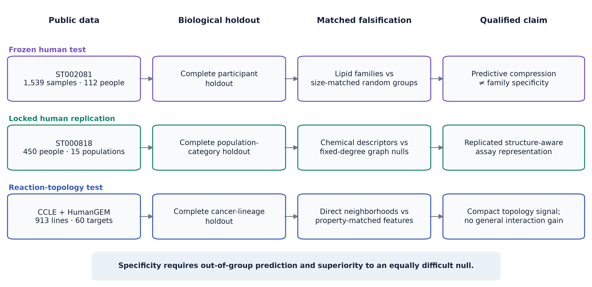
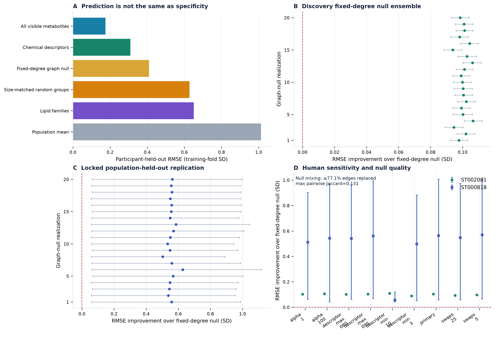
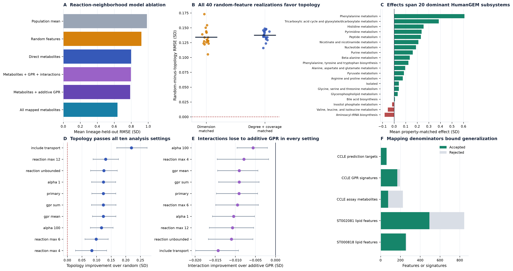

# Matched nulls reveal specificity limits of metabolic pathway scores

## Authors

Oğuzcan Ünver¹

¹ Metastate Bio Inc, Wilmington, Delaware, USA

Correspondence: can@metastate.bio

ORCID: 0009-0007-2023-5084

## Abstract

Pathway scores compress metabolomic profiles into interpretable biological summaries, but a score
can predict well without its declared pathway boundaries carrying specific information. We tested
metabolic representations by asking whether they reconstruct hidden measurements in biological
groups excluded from model fitting and outperform random representations of equal complexity. In
1,539 longitudinal samples from 112 people, broad lipid families achieved R²=0.588 but were inferior
to size-matched random groups. Structure-resolved lipid descriptors achieved R²=0.907 and exceeded
fixed-degree graph nulls; this result replicated in 450 people from 15 population categories
(R²=0.617), with all 20 graph nulls rejected. In 913 cancer cell lines, direct HumanGEM
neighborhoods predicted 60 metabolites across held-out lineages and improved RMSE by 0.134 standard
deviations (95% CI 0.093–0.177) against 20 dimension-matched random feature draws. A harder
degree-and-coverage-matched null gave 0.137 (0.097–0.181). Additive expression gave the lowest
compact-model RMSE; transcript interactions added no general increment. All post-result human and
CCLE sensitivity settings passed. These results
establish a falsification-led qualification framework: metabolic scores should earn
pathway-specific interpretation only when their structure retains unseen information beyond an
equally complex random structure. The framework validates representation and prioritization, not
physiological flux, causality or clinical utility.

## Introduction

Metabolomics provides a high-dimensional view of biochemical state, but most interpretation
workflows reduce measured metabolites to sets, pathways or latent scores. Metabolite Set Enrichment
Analysis, Pathway Activity Profiling, mummichog and probabilistic network methods each place
measurements into biological context in different ways [1–4]. Single-sample pathway analysis
extends this idea by transforming each person or sample from metabolite space into pathway-score
space [5]. These transformations can stabilize noisy measurements and make profiles readable.
They can also attach a biological name to covariance that would be captured by almost any grouping
of the same size.

This distinction is consequential for personalized interpretation. A score may outperform a
population mean because it compresses correlated markers, yet still provide no evidence that its
declared pathway membership is special. Metabolomics pathway analyses are sensitive to the assay
background, metabolite identification, pathway database and scoring rule [6]. Lipid ontology work
has shown that headgroup, chain length and unsaturation encode chemical and biophysical structure
[7], but the predictive specificity of such structure has not generally been tested against null
incidence graphs preserving both annotation depth and descriptor prevalence.

Genome-scale metabolic models supply a second level of structure. Human1 contains curated
metabolites, reactions and gene–protein–reaction (GPR) rules [8]. The Cancer Cell Line Encyclopedia
(CCLE) couples broad metabolomics with molecular profiles across hundreds of cell lines [9], making
it possible to ask whether reaction neighborhoods generalize across lineages. However, a direct
reaction neighborhood can also look successful because metabolomics is highly correlated. A fair
test requires random feature sets with the same dimensions and identical validation folds.

Cross-omic interpretation introduces a separate risk. MOFA, DIABLO and similarity network fusion
integrate modalities measured in overlapping samples [10–12]. Public genomics, transcriptomics,
metabolomics, isotope and perturbation studies often contain different people, tissues or model
systems. Merging such sources into one personalized scalar would turn reference evidence into an
unmeasured individual attribute. Likewise, flux balance analysis and expression-contextualized
metabolic models estimate feasible or optimized flux states under explicit assumptions [13–17];
metabolite concentration alone is not flux.

We therefore developed a falsification-led benchmark with two requirements. First, a representation
must reconstruct measurements hidden from people, populations or lineages that did not contribute
to model fitting. Second, it must outperform a random representation matched for effective
complexity. We coupled this benchmark to a factorized evidence contract,
P=(M,G,T,R,E,U), that keeps measured metabolic state (M), genetic support (G), transcript state (T),
constraint-derived reserve (R), perturbational evidence (E) and uncertainty or unavailable
components (U) separate. Applying this framework to two public human lipidomic cohorts, CCLE and
bounded supporting datasets reveals a resolution-dependent pattern: broad biochemical classes compress profiles
without establishing specificity, whereas structure-resolved lipid attributes and direct reaction
neighborhoods retain reproducible information beyond matched random controls (Fig. 1).

## Results

### Broad lipid families predict hidden markers but fail the specificity test

The frozen ST002081 benchmark used the longitudinal lipidomic cohort reported by Hornburg and
colleagues [18]. After participant and complete-case eligibility, 493 lipids from nine families
remained in 1,539 samples from 112 people. Five disjoint panels ensured that every eligible lipid
was hidden exactly once. All transformations and ridge fits were trained in participant-isolated
folds.

Family scores achieved a row-weighted held-out RMSE of 0.650 training-fold standard deviations and
pooled R²=0.588, compared with RMSE 1.013 and R²=0 for the training-fold population mean. The
participant-paired RMSE improvement was 0.397 SD (95% bootstrap interval 0.351–0.446). Thus broad
families retained substantial person-level profile information.

They nevertheless failed the frozen pathway-specificity gate. Size-matched random groups achieved
RMSE 0.627 and R²=0.617. The paired family-score improvement was −0.026 SD (−0.043 to −0.010), in
favor of the random grouping. Family scores produced precision@3 of 0.403 for top-decile hidden
deviations versus 0.369 for random groups, but the paired interval crossed zero (−0.025 to 0.059).
The all-visible model reached RMSE 0.175 and R²=0.970. Coarse family scores therefore compressed a
strong low-rank lipid covariance structure, but the family labels did not explain exact
reconstruction better than random labels of equal size (Fig. 2A).

### Lipid structure survives fixed-degree nulls and external population holdout

After opening the coarse-family result, we explicitly labeled a structural follow-up as adaptive.
Ninety-five descriptors represented lipid class or headgroup, total carbon and unsaturation, and
individual acyl-chain length and unsaturation. The matched null randomized the feature–descriptor
incidence graph while preserving every lipid degree and every descriptor degree [20]. This controls
both how richly each lipid is annotated and how prevalent each descriptor is.

Structure-resolved scores achieved RMSE 0.309, pooled R²=0.907, precision@3=0.888 and NDCG@3=0.891.
The primary fixed-degree random graph achieved RMSE 0.410, R²=0.836, precision@3=0.744 and
NDCG@3=0.804. Participant-paired structural improvements were 0.102 RMSE SD (0.097–0.108) and 0.137
precision (0.122–0.152). Across 20 additional graph-null realizations, RMSE improvements ranged
from 0.094 to 0.107; the smallest lower confidence limits remained positive for RMSE (0.088) and
precision (0.107).

We next locked a separate replication before retrieving its abundance matrix. Metabolomics
Workbench ST000818 analysis AN001299 contributed 255 eligible lipids from 450 blood samples in 15
population categories [23]. All members of a population category were assigned to the same outer
fold. Structural scores achieved RMSE 1.237, R²=0.617, precision@3=0.574 and NDCG@3=0.716. Coarse
families achieved RMSE 1.878 and R²=0.118; the all-visible model achieved RMSE 0.840 and R²=0.824.
Across 20 fixed-degree nulls, structural RMSE improvement ranged from 0.503 to 0.628 SD and
precision improvement from 0.091 to 0.115. Every population-bootstrap interval passed; the smallest
lower bounds were 0.057 SD for RMSE and 0.072 for precision.

The human robustness grid varied descriptor prevalence, graph randomization depth and ridge
regularization. In both cohorts, all nine settings preserved all degrees, all RMSE and precision
point improvements were positive, and every confidence interval excluded zero. The narrowest
replication result arose when descriptors had to occur in at least ten features: RMSE improvement
fell to 0.056 SD but retained a positive lower bound of 0.042. The result is therefore robust across
the declared analysis choices, although the grid remains post-result evidence.

A graph-mixing diagnostic regenerated all 200 panel-specific nulls. Every row and column degree was
preserved, every panel contained 20 unique graphs, the minimum observed-edge replacement was 0.771,
and the maximum pairwise null Jaccard was 0.131. Thus the null ensemble moved substantially away
from the biological incidence graph, although this diagnostic does not prove perfectly uniform
sampling over all graphs with the same degrees.
The complete discovery, replication and sensitivity effects are shown in Fig. 2B–D.

### Direct reaction neighborhoods generalize across cancer lineages

CCLE supplied 913 cell lines with aligned metabolomics, RNA expression and lineage labels [9]. Of
225 assayed metabolites, 76 had eligible stable mappings to HumanGEM. Sixty target metabolites had
at least 300 measurements, an assayed neighbor on a direct non-transport reaction containing no
more than eight metabolites, and a complete reaction-linked GPR signature.

The matched random factorized model achieved mean equal-lineage RMSE 0.920 SD and median target
R²=0.045. Direct metabolites alone improved RMSE to 0.798 and produced positive R² for 53 of 60
targets. Adding GPR expression signatures additively produced the best compact model (RMSE 0.788;
median R²=0.270). The full interaction model achieved RMSE 0.797 and median R²=0.241, with positive
R² for 52 targets. Its improvement over the dimension-matched random model was 0.124 SD
(target-bootstrap interval 0.083–0.167).

Transcript interactions did not supply a general increment. They were indistinguishable from the
direct-metabolite model (improvement 0.002 SD, −0.010 to 0.014) and were 0.009 SD worse than additive
GPR features (0.004–0.014 in favor of the additive model). An all-metabolite model remained stronger
(RMSE 0.638; median R²=0.567; 58 positive-R² targets), showing that direct topology trades complete
covariance for compactness and interpretation.

The topology result survived all ten post-result sensitivity settings. Reaction size limits,
transport inclusion, ridge penalties and GPR aggregation produced positive random-control
improvements with lower bounds from 0.028 to 0.169 SD. Median target R² was positive in every
setting. Including transport increased the eligible targets from 60 to 63 and gave the largest
improvement (0.219 SD), an exploratory observation. Interactions failed to beat additive GPR
features in all ten settings.

The primary benchmark used one prespecified random feature seed. A post-result stochastic-null
ensemble regenerated all target-specific random metabolite, GPR and interaction sets for 20
additional seeds. Biological-factorized RMSE was invariant, while random RMSE ranged from 0.902 to
0.970 SD. Every seed retained a positive target-bootstrap lower bound. Averaging random performance
within target gave an expected-null improvement of 0.134 SD (0.093–0.177); individual seed effects
ranged from 0.105 to 0.173 SD. The reaction-topology result is therefore not attributable to a
single weak random draw.

A harder post-result null additionally matched each random metabolite on direct-network degree and
assay coverage and each random GPR signature on candidate-network degree, without using target
abundance or correlation. All 20 matched seeds passed; the expected-null improvement was 0.137 SD
(0.097–0.181), and mean log-degree imbalances were 0.055 for metabolites and 0.009 for signatures.
To address target dependence, targets were assigned to 20 dominant HumanGEM subsystems. The
cluster-bootstrap interval remained positive (0.086–0.194), and every leave-one-subsystem-out mean
was positive (minimum 0.120 SD).
Model ablations, null ensembles, subsystem effects, parameter sensitivity and mapping denominators
are shown in Fig. 3.

### Cross-omic evidence supports topology but keeps stronger claims closed

A prior reaction-resolved CCLE screen identified one FDR-significant interaction among 284 tests:
higher CDA expression reduced cytidine–uridine coupling (standardized interaction β=−0.222,
HC3 SE=0.0297, q=2.16×10⁻¹¹). The direction survived all lineage and holdout checks and added
out-of-fold ΔR²=0.046 for that selected relationship. The all-target benchmark shows why this
candidate cannot justify universal interaction expansion: interactions lose on average in every
sensitivity setting, and the CDA state did not validate against prespecified drug or CRISPR
outcomes.

Human genetics supplied topology support rather than same-person fusion. Among 71 eligible METSIM
gene–metabolite states [19], 26 linked the knowledge-nominated gene and metabolite on a direct
HumanGEM reaction. None of 100,000 within-panel, global degree-matched or biochemical-class
permutations reached 26 recoveries (plus-one empirical P=9.9999×10⁻⁶ for each null). Because the
gene nominations were knowledge based, this is a positive-control audit of network topology rather
than independent causal-gene discovery.

External challenges remained negative where stronger interpretation required them. Public NSCLC
isotope data [21] yielded no FDR-significant expression-module, oncogenotype or ACO1 result. In the
human longitudinal cohort, forward prediction (R²=0.452) did not beat reverse-time prediction
(R²=0.459). A 1,000-draw HumanGEM constraint ensemble separated stable configured controls from
unstable mechanisms but lacked organ-specific exchange-rate calibration. Consequently, no result
is described as measured flux, temporal causality, treatment response or individual genomic
personalization.

### Mapping coverage defines the result's domain

The mapping audit retained accepted and rejected rows. It retained 255 of 260 ST000818 lipids and
493 of 845 ST002081 lipids under the complete-case and parser gates. In CCLE, 76 of 225 assay
metabolites mapped to the eligible HumanGEM representation, 169 of 195 GPR signatures were used, and
all 60 primary targets had complete feature-set records. The reaction result therefore applies to
the mapped, network-accessible assay subset rather than the entire CCLE metabolome.

## Discussion

The central result is a resolution-dependent test of biological specificity. Broad lipid classes
were useful compressors but did not beat random groups of identical size. Lipid structural
descriptors beat a stronger null that preserved both feature annotation depth and descriptor
prevalence, and the result survived a separately locked population-held-out cohort. Direct
HumanGEM neighborhoods likewise generalized across cancer lineages and beat matched random
features. These observations support a practical qualification rule: biological labels should
earn pathway-specific language only when their structure retains unseen information beyond an
equally complex random structure.

For the human analyses, “structure” refers to chemical descriptors encoded in assay feature names.
Their success validates a structure-aware representation of the measured lipid panel. It does not,
by itself, establish pathway activity, physiological regulation or reaction flux. The CCLE test is
separately reaction-topological and remains confined to mapped intracellular cell-line data.

This framework complements enrichment and ssPA rather than replacing them. Enrichment asks which
sets are overrepresented or altered. ssPA asks how to represent a sample in pathway space, and has
been benchmarked using semi-synthetic pathway perturbations [5]. Our endpoint is real-data
information retention: can visible members reconstruct hidden members outside people, populations
or lineages used for fitting? The two questions can disagree, as the coarse lipid result shows. A
score may be useful for visualization or denoising without supporting pathway-specific inference.

The CCLE result also bounds the role of transcriptomics. Additive GPR expression supplied a small
general increment, but interaction terms did not. One robust CDA-conditioned relationship
coexists with this negative average result. The architecture is therefore consistent with sparse
effect modification, not with an interaction term for every connected metabolite and enzyme.
Candidate-specific testing with multiplicity control is more defensible than universal expansion.

The factorized evidence contract addresses a different failure mode. The human lipid cohorts,
METSIM, CCLE, NSCLC and constraint model do not contain the same people or measurement types.
Agreement across them is triangulation. Genetic topology can annotate the plausibility of a
measured pathway, but it cannot be displayed as a person's genetic capacity when that person's DNA
was not supplied. Expression can contextualize a cancer-cell model but is not inherited genotype.
Constraint sensitivity can expose model fragility but is not measured flux. Keeping these
components separate preserves useful evidence without manufacturing a synthetic multi-omic person.

The study has limitations. ST002081 is a repeated cohort dominated by structurally related lipids;
the structural analysis was adaptive. ST000818 is a locked external cohort, but its population,
diet and platform differ, and no source publication was identified for AN001299 beyond repository
metadata. CCLE contains transformed cell lines and only 76 of 225 metabolites mapped to the
eligible network representation. Plasma and intracellular abundance are not reaction rates.
Knowledge-based gene nomination limits the independence of the mQTL topology audit. The sensitivity
grids were designed after primary results and demonstrate robustness, not prospective confirmation.
Finally, ridge models were chosen for auditability. A nonlinear predictor might improve accuracy,
but accuracy alone would not validate pathway identity without the same matched-null tests.

The output is therefore a research-grade credibility layer, not a clinical claim. For personalized
metabolomics, it supports assay-calibrated structural scores, hidden-marker prioritization and
transparent reaction annotations. Before use on a new customer assay, the feature map, missingness,
normalization and benchmark population must be recalibrated. Prospective outcomes, paired human
genomics and metabolomics, and calibrated flux measurements remain separate future validation
tasks.

Operationally, a person-level interpretation should expose the input basis, measured feature
coverage, representation benchmark, uncertainty and candidate validation markers rather than
collapse these dimensions into one confidence percentage. The same falsification principle applies
to constraint-derived outputs: model feasibility or sensitivity should not be called a process
bottleneck until it survives plausible bounds and objectives and agrees with held-out measurements
or perturbations. These are separate application contracts linked by a common requirement that a
biological label survive serious alternatives.

## Methods

### Protocol, evidence roles and claim boundary

The primary human missing-panel and CCLE prediction designs, feature definitions, models and gates
were frozen before execution. The structural human follow-up was prespecified after viewing the
coarse result and was labeled adaptive. ST000818 was selected from a pre-existing public-study
registry using metadata and metabolite names; its protocol was frozen before retrieval of the
abundance matrix. Human and CCLE parameter grids were registered after their primary results and
are labeled post-result sensitivity. Existing mQTL, interaction, isotope, longitudinal and
constraint analyses were supporting evidence and were not counted as untouched replication.

No analysis was allowed to establish diagnosis, treatment response, physiological flux or
same-person genomic personalization. Concentration prediction was not described as flux, and
expression was treated as cell state rather than germline genotype.

### Human missing-panel benchmark

We used the checksum-pinned Metabolomics Workbench ST002081 mwTab source linked to the published
cohort [18]. Samples without a usable participant identifier were excluded. Features complete
across the retained samples were assigned to deterministic families: names beginning with TAG
formed the triacylglycerol family; otherwise the prefix before the first parenthesis defined the
family. Families with fewer than five complete features were excluded.

Seeded round-robin assignment generated five disjoint hidden panels within families. Each feature
was an outcome in one panel and absent from that panel's predictors. Five outer folds isolated all
samples from a participant. Four models were fitted with ridge alpha 10: training-fold population
mean; median scores from randomly reassigned visible markers preserving family sizes; median scores
from declared visible families; and all visible markers. Imputation, means, standard deviations and
models were fitted within training folds.

Primary endpoints were pooled out-of-fold R², row-weighted RMSE and equal-participant RMSE.
Prioritization endpoints were precision@3 and NDCG@3 for markers in the sample-specific top decile
of absolute standardized hidden deviations. Confidence intervals used 5,000 participant-bootstrap
draws.

### Structural descriptors and fixed-degree nulls

Lipid names were parsed into binary descriptors for class or headgroup, total carbon, total
unsaturation, individual chain length and individual chain unsaturation, following standard lipid
classification principles [22]. Descriptors occurring in fewer than five or more than 90% of
eligible features were excluded in the primary setting. Within each hidden panel, each feature was
predicted from median scores of its visible descriptors using the same folds and training-only
transformations.

The null applied double-edge swaps to the visible feature–descriptor bipartite graph. Every feature
degree and descriptor degree was preserved while biochemical identity was disrupted. The discovery
audit used the primary seed plus 20 additional seeds, each with complete refitting and bootstrap.
Null quality was assessed post-result by observed-edge replacement, observed-null Jaccard,
within-panel uniqueness and all pairwise null-null Jaccard similarities for the 20 reported seeds
in each of five panels and both cohorts.
No favorable null was selected.

### Locked human replication

ST000818 analysis AN001299 contained 450 blood samples, one repository participant per sample, in
15 population categories of 30. The frozen parser retained 255 complete lipids from six families
and 81 descriptors. Five outer folds held out complete population categories. Hidden panels,
regularization and endpoints followed discovery. Twenty separately fitted fixed-degree graphs were
prespecified. Replication required positive lower 95% confidence bounds for both RMSE and
precision@3 against every graph under population-category bootstrap.

The post-result human grid varied ridge alpha (1, 10, 100), minimum descriptor prevalence (3, 5,
10), maximum prevalence (0.80, 0.90, 0.95) and swaps per edge (5, 10, 25), yielding nine unique
settings including primary. Each setting used 2,000 group-bootstrap draws and a deterministic null
seed.

### CCLE direct-network benchmark

Checksum-pinned CCLE 2019 metabolite abundance, RNA expression and lineage files were aligned by
cell line [9]. Normalized-name expansion was accepted only when it resolved uniquely to a
HumanGEM metabolite with stable annotation. Candidate neighborhoods used direct non-transport
reactions with at most eight metabolites; protein-degradation pseudo-reactions were excluded.
GPR alternatives were separate signatures and required complexes used the least-expressed subunit.

A target required at least 300 measured samples, at least one assayed direct neighbor and one
complete GPR signature. Models comprised population mean; dimension-matched random metabolites,
GPR signatures and interactions; direct metabolites; direct metabolites plus additive GPR
signatures; direct metabolites, signatures and declared products; and every other mapped
metabolite. Random features excluded target neighborhoods and signatures where possible and
preserved the number of each feature type.

Two repeats of five deterministic size-balanced folds held out complete lineages. Training medians
were used for imputation. Predictors and outcomes were scaled on training data; interaction products
were created after base-feature scaling and rescaled within training. Ridge alpha was 10. The
primary metric was target-level equal-lineage RMSE. Paired intervals used 5,000 target-bootstrap
draws.

The post-result grid varied maximum reaction size (4, 6, 8, 12, unbounded), transport inclusion,
ridge alpha (1, 10, 100) and GPR aggregation (limiting subunit, mean, sum). Ten complete settings
were fitted. Each regenerated its matched random control.

A separate post-result null ensemble held the biological features, target set, folds and model
settings fixed while regenerating dimension-matched random features from 20 deterministic seeds.
Every realization was fitted independently. Per-seed uncertainty used 2,000 target-bootstrap draws.
The expected-null contrast averaged random RMSE within target across seeds and used 5,000 paired
target-bootstrap draws.

The property-matched null used minimum-cost bipartite assignment. Random metabolites matched
direct-network neighbors on log direct-network degree and global outcome-independent assay
coverage; random GPR signatures matched reaction-linked signatures on log candidate-network
degree. A small seeded jitter varied near-equivalent assignments. Twenty complete seeds were
refitted and evaluated under the same gates as the dimension-matched ensemble.

For the dependence audit, each target was assigned to the HumanGEM subsystem occurring most often
among its eligible direct candidate rows, with alphabetical tie resolution. Ten thousand bootstrap
draws resampled the resulting subsystem clusters with all member targets, and leave-one-subsystem-
out effects were computed exhaustively. This deterministic grouping is a dependence sensitivity,
not a claim that HumanGEM subsystems are mutually independent.

### Mapping, provenance and supporting evidence

The human mapping table contains original name, family, all parsed descriptors, hidden-panel
assignment, acceptance and exclusion reason. CCLE tables contain assay name, stable identifiers,
HumanGEM metabolite and compartment, GPR availability, and all features used for each target. All
source and result manifests contain SHA-256 checksums and are verified by the publication synthesis.

Supporting evidence comprised a 71-state METSIM–HumanGEM topology audit [19]; reaction-resolved
CCLE coupling; UKB/BBJ summary-statistic scans; NSCLC isotope challenges [21]; public BCAA
perturbations; a 1,000-draw HumanGEM constraint ensemble; and an earlier longitudinal direction
test. These sources differ in participants, tissue, organism and assay. They were adjudicated as
separate domains, not pooled as participant-level observations.

### Computational and generative-AI assistance

OpenAI Codex was used under the author's direction for literature triage, code generation,
analysis orchestration, quality-control checks, figure preparation, manuscript drafting and
internal adversarial review. Quantitative results were generated by the executable analysis code
from checksum-pinned public inputs and are linked to machine-readable outputs, sensitivity grids
and provenance ledgers. The author defined the research questions and claim boundaries, directed
the computational programme, interpreted the resulting evidence and retains responsibility for
the integrity and final approval of the work. The AI system is not an author.

## Data Availability

All analyzed datasets are public. ST002081 is available from Metabolomics Workbench under
doi:10.21228/M8ZM5P and ST000818 under doi:10.21228/M89M31. The CCLE metabolomics source is
described by Li et al. [9]. METSIM summary results are described by Yin et al. [19]. Human1 is
available through the Human-GEM project [8]. Raw public files are not redistributed in the source
repository; scripts, source URLs, versions and checksums define retrieval and integrity.

## Code Availability

The analysis code, frozen protocols, configurations, aggregate metrics, complete sensitivity grids,
accepted/rejected mapping ledgers, figures and machine-readable claim ledger are included in the
repository. A permanent public repository URL, software license and archival DOI must be inserted
before submission. The principal output directories are `artifacts/pathway-score-st002081/`,
`artifacts/pathway-score-st002081-structural/`,
`artifacts/pathway-score-st000818-replication/`, `artifacts/pathway-score-ccle/`,
`artifacts/pathway-score-human-sensitivity/`, `artifacts/pathway-score-ccle-sensitivity/`,
`artifacts/pathway-score-human-graph-mixing/`,
`artifacts/pathway-score-ccle-null-ensemble/`,
`artifacts/pathway-score-ccle-property-matched-null/`,
`artifacts/pathway-score-ccle-reaction-cluster/`,
`artifacts/pathway-score-mapping-supplement/`, `artifacts/pathway-score-publication-figures/` and
`artifacts/factorized-pathway-publication/`.

## Figure legends

**Figure 1 | Falsification-led qualification design.** Three public-data experiments separate
source data, biological holdout, matched null and the claim each analysis can support. ST002081 is
the frozen coarse-family test; ST000818 is the protocol-locked external structural replication;
CCLE plus HumanGEM is the lineage-held-out reaction-topology test. The experiments qualify
representations and do not measure physiological flux or clinical utility.

**Figure 2 | Human prediction, specificity, external replication and robustness.** **A,**
Participant-held-out ST002081 RMSE for population, coarse-family, size-matched random,
fixed-degree-null, structure-resolved and all-visible representations. Lower is better. The coarse
family score predicts but loses to size-matched random grouping. **B,** Structural-minus-null RMSE
improvement and 95% participant-bootstrap intervals for 20 ST002081 fixed-degree graph nulls.
**C,** Corresponding population-category bootstrap results in locked ST000818. **D,** Complete
post-result human parameter grid. Error bars are 95% paired group-bootstrap intervals. The inset
reports the worst edge replacement and maximum pairwise null Jaccard across 200 panel-specific
graphs.

**Figure 3 | Reaction topology survives hard nulls while interactions fail.** **A,** Mean
equal-lineage RMSE across 60 CCLE targets for the model ablation. **B,** Random-minus-topology RMSE
for 20 dimension-matched and 20 network-degree-and-coverage-matched feature realizations; lines
show ensemble means. **C,** Mean property-matched target effect in each dominant HumanGEM
subsystem. Negative subsystem means are shown in red; cluster-resampled inference is reported in
the text. **D,** Topology-versus-random effects and 95% target-bootstrap intervals for all ten
post-result settings. **E,** Interaction-versus-additive-GPR effects; negative values favor the
additive model. **F,** Accepted and rejected mapping denominators.

## References

1. Xia, J. & Wishart, D. S. MSEA: a web-based tool to identify biologically meaningful patterns in
   quantitative metabolomic data. *Nucleic Acids Res.* **38**, W71–W77 (2010).
2. Aggio, R. B. M., Ruggiero, K. & Villas-Bôas, S. G. Pathway Activity Profiling (PAPi): from the
   metabolite profile to the metabolic pathway activity. *Bioinformatics* **26**, 2969–2976 (2010).
3. Li, S. et al. Predicting network activity from high throughput metabolomics. *PLoS Comput. Biol.*
   **9**, e1003123 (2013).
4. Hosseini, R., Hassanpour, N., Liu, L.-P. & Hassoun, S. Pathway-Activity Likelihood Analysis and
   Metabolite Annotation for Untargeted Metabolomics Using Probabilistic Modeling. *Metabolites*
   **10**, 183 (2020).
5. Wieder, C., Lai, R. P. J. & Ebbels, T. M. D. Single sample pathway analysis in metabolomics:
   performance evaluation and application. *BMC Bioinformatics* **23**, 481 (2022).
6. Wieder, C. et al. Pathway analysis in metabolomics: recommendations for the use of
   over-representation analysis. *PLoS Comput. Biol.* **17**, e1009105 (2021).
7. Molenaar, M. R. et al. LION/web: a web-based ontology enrichment tool for lipidomic data
   analysis. *GigaScience* **8**, giz061 (2019).
8. Robinson, J. L. et al. An atlas of human metabolism. *Sci. Signal.* **13**, eaaz1482 (2020).
9. Li, H. et al. The landscape of cancer cell line metabolism. *Nat. Med.* **25**, 850–860 (2019).
10. Argelaguet, R. et al. Multi-Omics Factor Analysis—a framework for unsupervised integration of
    multi-omics data sets. *Mol. Syst. Biol.* **14**, e8124 (2018).
11. Singh, A. et al. DIABLO: an integrative approach for identifying key molecular drivers from
    multi-omics assays. *Bioinformatics* **35**, 3055–3062 (2019).
12. Wang, B. et al. Similarity network fusion for aggregating data types on a genomic scale.
    *Nat. Methods* **11**, 333–337 (2014).
13. Orth, J. D., Thiele, I. & Palsson, B. Ø. What is flux balance analysis? *Nat. Biotechnol.*
    **28**, 245–248 (2010).
14. Machado, D. & Herrgård, M. Systematic evaluation of methods for integration of transcriptomic
    data into constraint-based models of metabolism. *PLoS Comput. Biol.* **10**, e1003580 (2014).
15. Wagner, A. et al. Metabolic modeling of single Th17 cells reveals regulators of autoimmunity.
    *Cell* **184**, 4168–4185.e21 (2021).
16. Alghamdi, N. et al. A graph neural network model to estimate cell-wise metabolic flux using
    single-cell RNA-seq data. *Genome Res.* **31**, 1867–1884 (2021).
17. Brunk, E. et al. Recon3D enables a three-dimensional view of gene variation in human metabolism.
    *Nat. Biotechnol.* **36**, 272–281 (2018).
18. Hornburg, D. et al. Dynamic lipidome alterations associated with human health, disease and
    ageing. *Nat. Metab.* **5**, 1578–1594 (2023).
19. Yin, X. et al. Genome-wide association studies of metabolites in Finnish men identify
    disease-relevant loci. *Nat. Commun.* **13**, 1644 (2022).
20. Strona, G., Nappo, D., Boccacci, F., Fattorini, S. & San-Miguel-Ayanz, J. A fast and unbiased
    procedure to randomize ecological binary matrices with fixed row and column totals.
    *Nat. Commun.* **5**, 4114 (2014).
21. Chen, P.-H. et al. Metabolic diversity in human non-small cell lung cancer cells.
    *Mol. Cell* **76**, 838–851.e5 (2019).
22. Fahy, E. et al. A comprehensive classification system for lipids. *J. Lipid Res.* **46**,
    839–861 (2005).
23. Metabolomics Workbench. Integrated nutrigenomic and metabolomic analysis of Africans with
    variable diet, study ST000818, analysis AN001299. doi:10.21228/M89M31.
24. Picart-Armada, S. et al. Null diffusion-based enrichment for metabolomics data. *PLoS ONE*
    **12**, e0189012 (2017).
25. Hänzelmann, S., Castelo, R. & Guinney, J. GSVA: gene set variation analysis for microarray and
    RNA-seq data. *BMC Bioinformatics* **14**, 7 (2013).

## Acknowledgements

This research received no external funding. Computational resources were provided by Metastate Bio
Inc.

## Author Contributions

O.Ü. conceived the study, defined the research questions and claim boundaries, directed the
computational programme, provided resources, interpreted the results through iterative review,
revised the manuscript and accepts responsibility for the integrity of the work. CRediT roles:
Conceptualization, Methodology, Resources, Supervision, Project administration, and Writing –
review & editing.

## Competing Interests

O.Ü. is the founder of Metastate and is affiliated with Metastate Bio Inc, which develops
commercial metabolic interpretation and modeling products and services that could benefit from
the publication of this work. The author declares no other competing interests.
